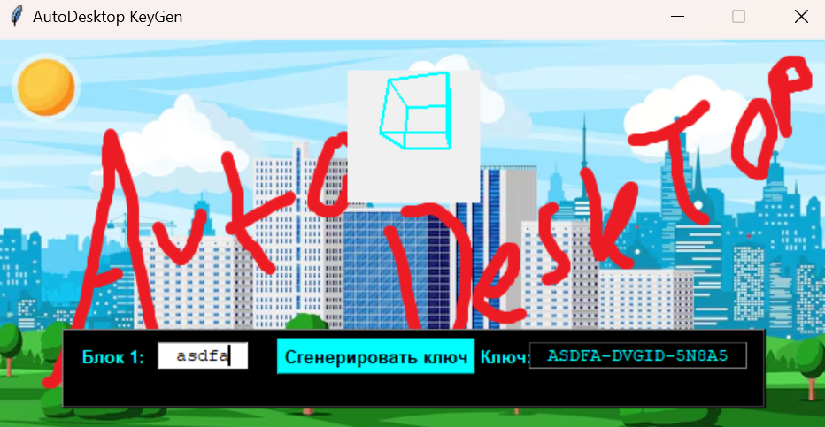

# Lab-3



## Laboratory Work №3

**Task**

Using ```tkinter```, implement a keygen – a program that generates a key for some abstract software (we condemn piracy) with an appropriate user interface design.

* Choose your favorite game, find artwork or a related picture in a search engine.
* Implement the key generator form, which should include at least: a field for the generated key, a start button, the selected background image, and a text input field if required by the variant.
* Implement the key generator. The key consists of characters from Latin letters **A-Z** and digits **0-9**. Depending on the variant, input of the first part of the key may be required (specified in the variant). The key is generated according to certain rules. In tasks with shifts, assume that letters and digits are arranged sequentially on an infinite tape that can be shifted left or right.

**Variants**

| Variant | Input Part | Key Format | Generation Rule |
| ------- | ----------- | ---------- | --------------- |
| 1 | none | XXXXX-XXXXX-XXXXX | Each block has two digits and three letters in random order. Example: FX26N-N3RT7-AZ0J8 |
| 2 | none | XXXX-XXXX-XXXX-XXXX | Each block has one digit and three letters in random order. Example: AB8U-Z0MI-7FYK-K9GT |
| 3 | HEX-number 5 digits | XXXXX-XXXXX-XXXXX XX | Input part of the key – a number in HEX, which must be converted to DEC. The first three digits of the DEC number must appear one in each block, the last two digits at the end of the key. Example: 54CD1(HEX)=347345(DEC) -> DS**3**BG-**4**09KJ-T6**7**K8 **45** |
| 4 | none | XXXX-XXXX-XXXX | Assign weight coefficients to characters, generate ensuring that the sum of weights in each block falls into an interval. Example: let A=1, B=2,… Interval = 30…35 -> YABD-NBCO-DGIK -> Sums: 32-34-31 |
| 5 | 1 key block | XXXXX-XXXXX-XXXXX | Based on the entered fragment of the key, generate the rest: block 2 – shift 3 characters to the right, block 3 – shift 5 characters to the left. Example: JINOS-MLQRV-EDIJN |
| 6 | none | XXXXX-XXXX-XXXX | Assign weight coefficients to characters, generate ensuring that the average value of weights in each block falls into an interval. Example: let A=1, B=2,… Interval = 10…15 -> YAND-NZCQ-WGIK -> Averages: 11-15-12 |
| 7 | 6-letter word | XXX-XXXXXX-XXX | Block 1 and 3 – only letters from the entered word, block 2 – only digits corresponding to alphabet order numbers of letters (drop tens). Example: input "MASTER" -> TMR 319058 AES |
| 8 | DEC-number 3 digits | XXXXX-XXXX-XXX-XX | Block 1 – random combination of letters and digits, each subsequent block removes 1 character and shifts according to the next digit from the entered number. Shift direction alternates. Example: input "123" -> DRITF-ESJY-CPR-FS (shift 1 right – 2 left – 3 right) |
| 9 | none | XX XXXXXXX XX | Blocks 1 and 3 – alphabet order numbers of letters (not greater than 26) – interval boundaries, block 2 is filled with random letters from this interval. Example: A and J -> 01 DEBBHCI 10 |
| 10 | DEC-number 6 digits | XXXXX-XXXXX XXXX | Blocks 1 and 2 must contain digits 4,5,6 and 1,2,3 of the entered number respectively, the rest – random letters, block 3 – result of summing numbers from block 1 and block 2. Example: input "726911" -> **276**DL-**191**GO-0467 |

**Additional Task**

Add background music (preferably 8-bit) and animation.

**Notes**

DEC-number – number in decimal format  
HEX-number – number in hexadecimal format  
To convert HEX to DEC you can use: ```dec = int(hex, 16)```

About tkinter: https://pythonru.com/uroki/obuchenie-python-gui-uroki-po-tkinter  
Random module functionality: https://docs.python.org/3/library/random.html  